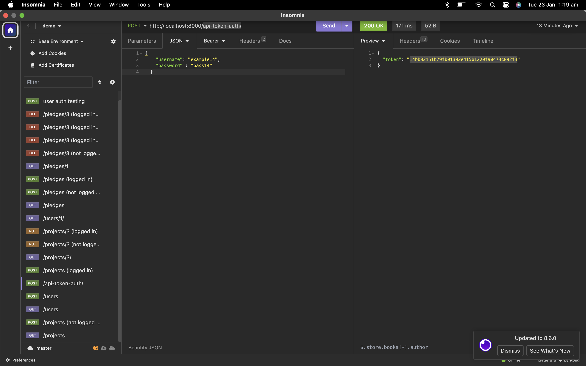

# Crowdfunding Back End
## OpenDoor by Karla Gaudet

[OpenDoor Website](https://drf-patient-pond-1055.fly.dev/projects/)

OpenDoor is a crowdfunding site that allows people to ask for financial sponsorships that will aid the sponsee to pay for study fees and/or study equipment and tools.
Link to OpenDoor: {{[OpenDoor](insert link here).}}
### Intended Audience/User Stories
OpenDoor is intended for anyone with a plan to pursue a study path to further their education and for sponsors to aid in gifting funds for that person to reach their goals.
### Front End Pages/Functionality
- Home Page
  * Nav Bar: Links pointing to a 1) Projects list page 2) A form for prospective project creation 3) Sign in/Login Form
  * CTA button: After a hero image, a button linking to a project creation form. If user is not logged in, an invitation will be presented to login/signup before creating a project.
  * Feature section displaying random single project pages with links to that individual project.
  * CTA button: A button linking to the projects list page.
  * Counter: X amount of sponsors have helped Y amount of doors open for people reaching their study goals by providing Z amount of dollars.
  * NO login required to display this page.
    
- Projects Page
  * A visual display of single projects asking for supporters.
  * Each single project listed will have an image, summary and goal amount with a counter (eg: "I need $x. I have $y to go!")
  * No login required to display this page.
  * CTA button: After a hero image, a button linking to a project creation form. If user is not logged in, an invitation will be presented to login/signup before creating a project.
  
- Single Project Page
  * Will display all the details for a single project.
  * Title, image, owner name, supporter status, date created, description.
  * On a side bar, pledge details unique to that project will be displayed.
  * Pledge details will include goal, donate button, list of pledges already made.
  * If user is not logged in, an invitation will be presented to login/signup before supporting a project.
  * No login required to display this page.
   
- Create Project form
  * A styled form that will allow a logged in user to create a new project.
  * Title, name, image upload, goal amount, status, description and date created.
  * Users must be logged in to create a project
 
  - Pledge form
    * A styled form that will allow a logged in user to support a project.
    * Summarised details about the project being supported, amount, comments, option to stay anonymous
    * User must be logged in to support a project.


## Screenshots 
#### GET method
 
#### POST Method
 
#### Token Feature
 

---

### How to:
#### - Register a new user (via Insomnia)

1) Select a new HTTP Request 
2) Choose POST method, URL: https://drf-patient-pond-1055.fly.dev/users/
3) Choose JSON as the text option
4) Enter the following JSON attributes:
```
{
		"username": "{enter your username}",
		"password": "{enter your password}",
		"first_name": "{enter your first name}",
		"last_name": "{ener your last name}",
		"email": "{enter your email}"
	}
```
1) Click Send
2) A new user will be created.
3) To recieve an authentication token, select a new HTTP Request
4) Choose POST method, URL: https://drf-patient-pond-1055.fly.dev/api-token-auth/
5) Choose JSON as the text option
6)  Enter the following JSON attributes:
    ```
    {
		"username": "{enter the registered username}",
		"password" : "{enter the password}"
	}
    ```
7)  Click Send and you will see a token. (Copy this to use for authentication purposes)

###### Example (new user registraion):


##### Example (user authentication token):



#### - Create a new project (via Insomnia)

1) To create a new project, you need to be logged in and authorised. 
2) Choose POST method, URL: https://drf-patient-pond-1055.fly.dev/projects/
3) Choose JSON as the text option
4)  Enter the following JSON attributes:
   ```
{
	"owner": "{id of owner}",
	"title": "{title}",
	"description": "{A description}",
	"goal": {Goal amount},
	"image": "{url of image}",
	"is_open": {false or true - is the project open for supporters},
	"date_created": "{date}"
  "category": "Agriculture{or other category}"

}
   ```

5) Open the "Auth" tab and choose "Bearer Token"
6) Enter the token number of the user creating the project
7) Under "Prefix" type "Token"
8) Click Send and a new project will be created under that user's login details.
  
  ##### Example (Creating a new project):


----
### API Spec

|  URL | HTTP Method | Purpose | Request Body | Success Response Code |Authentication/Authorisation |
| ---  | ----------- | ------- | ------------ | --------------------- |----------------------------|
|/projects/|POST|Creates a project|ASK ABOUT THIS SECTION|201|Must be logged in|
|/projects/|GET|List of all projects||200|N/A|
|/projects/<int:pk>/|GET|Returns a single project||200|N/A|
|/projects/<int:pk>/|PUT|Updates that single project||200|Must be logged in & is project owner|
|/projects/<int:pk>/|DELETE|Deletes an individual project||200|Must be logged in & is project owner|
|/pledges/<int:pk>/|PUT|Updates a single pledge||200|Must be logged in & is supporter|
|/pledges/<int:pk>/|DELETE|Deletes an single pledge||200|Must be logged in & is supporter|
|/pledges/|POST|Creates a new pledge||201|Must be logged in|
|/pledges/|GET|Lists all pledges||200|N/A|
|/users/|POST|Creates a new user|||201|N/A
|   |    |   |   |   |   |


------
### DB Schema


##### References and Resources:
* [Aggregation in Django](https://docs.djangoproject.com/en/5.0/topics/db/aggregation/)

* [Response() Function](https://www.django-rest-framework.org/api-guide/responses/#responses)

* [Model Field - Choices](https://docs.djangoproject.com/en/5.0/ref/models/fields/)

* [PrimaryKeyRelatedField](https://www.django-rest-framework.org/api-guide/relations/#primarykeyrelatedfield)